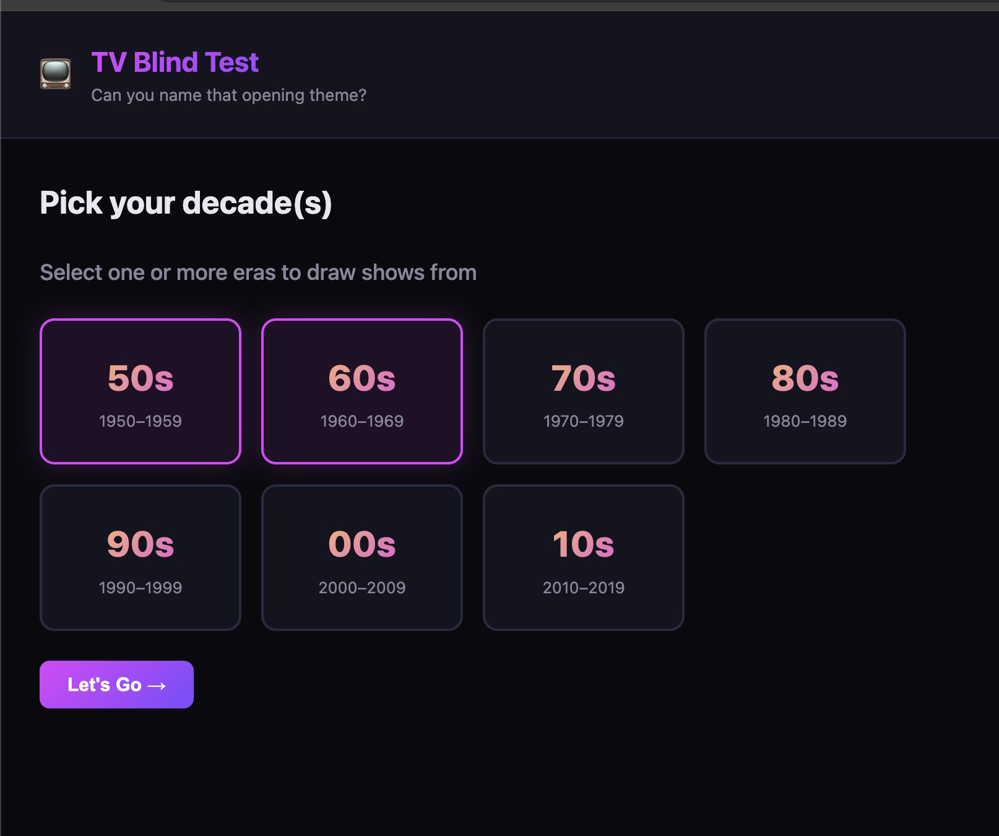
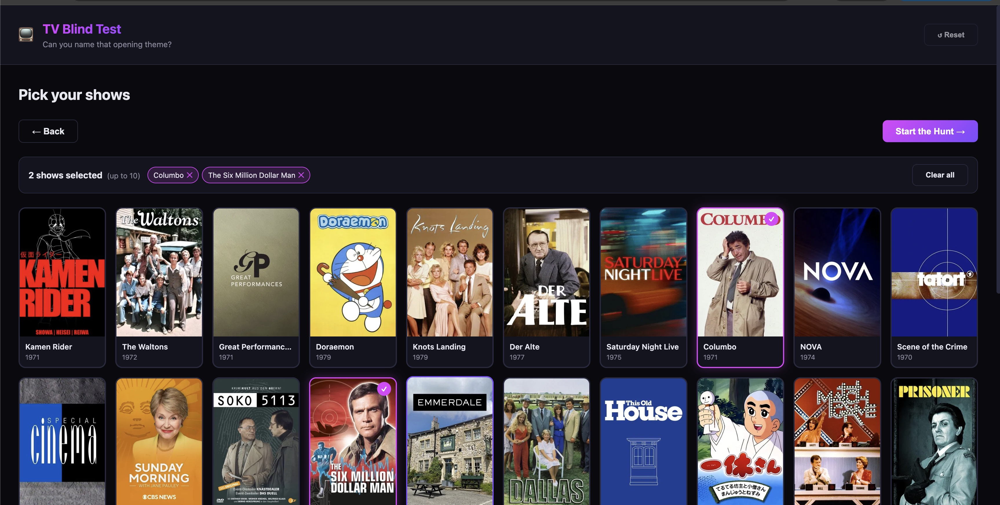
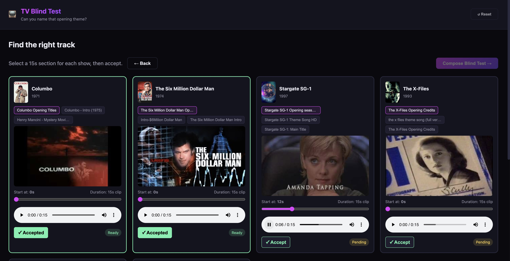
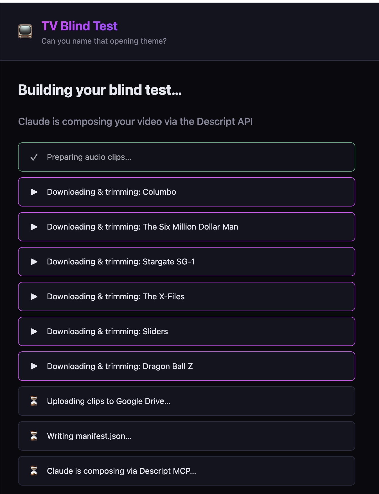
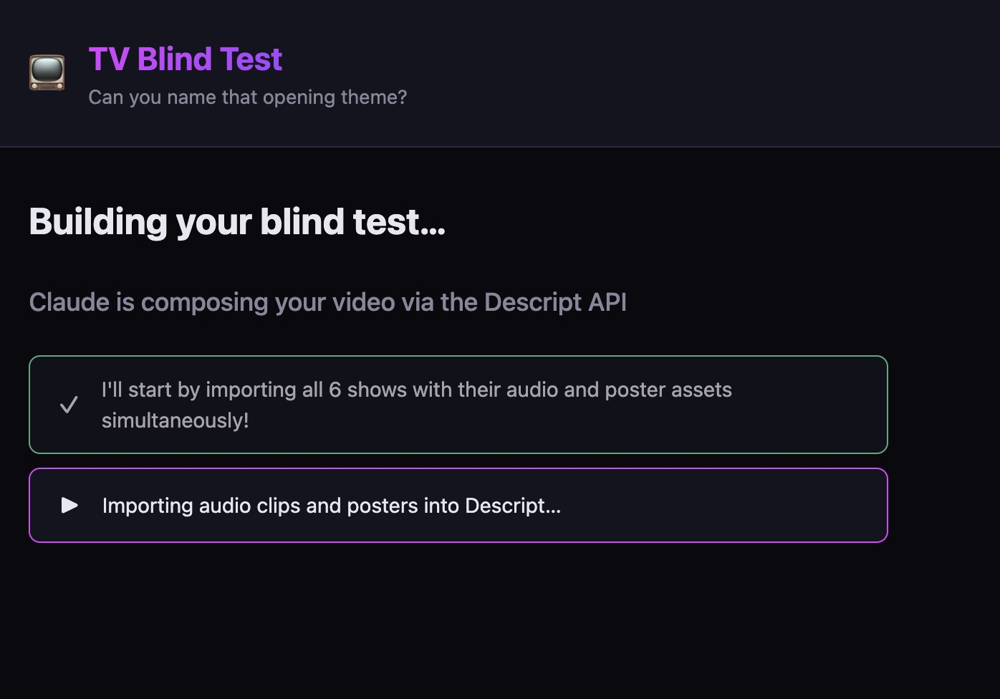
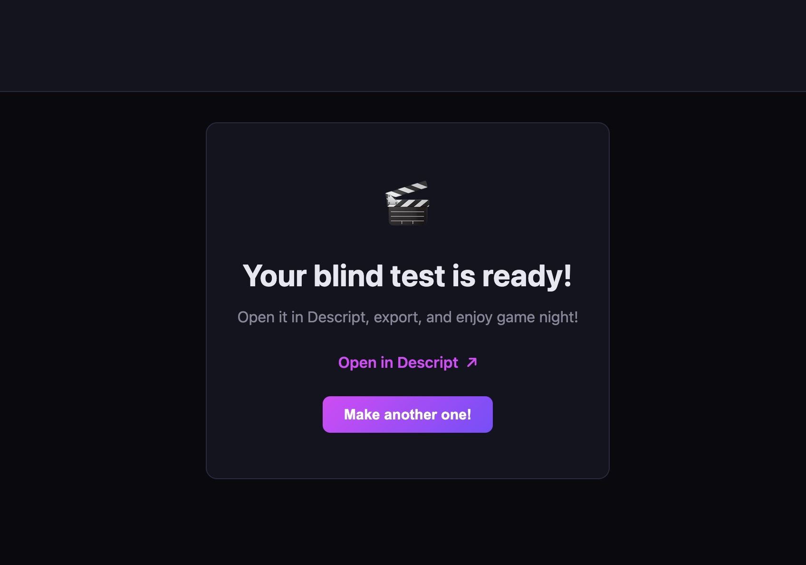

# 📺 TV Blind Test

A self-contained web app that builds a TV opening-theme blind test video using the Descript API. Pick a decade, choose your shows, validate 15-second clips, and get a fully composed Descript project ready to export and play at game night.

Built for the **Descript API Film Fest** challenge.

---

## How it works

**1. Pick decades** — choose one or more eras (50s–10s)



**2. Select shows** — browse TMDB's most popular shows for those decades, pick up to 10



**3. Find the music** — YouTube is searched automatically for each opening theme; scrub to the right 15s section and accept



**4. Compose** — audio is downloaded, trimmed, and uploaded to Google Drive



Then the Descript API builds the full video, step by step



**5. Done** — open the Descript project, export, and play



---

## Stack

| Layer | Tech |
|---|---|
| Backend | Express + TypeScript (`tsx` for dev) |
| Frontend | Vanilla HTML/CSS/JS SPA (no build step) |
| TV data | [TMDB API v3](https://developer.themoviedb.org/docs) |
| YouTube search & download | `yt-dlp` (bundled via `install.js`) |
| Audio trimming | `ffmpeg` (bundled via `install.js`) |
| Cloud storage | Google Drive API (OAuth 2.0) |
| Video composition | [Descript API](https://docs.descriptapi.com) |
| Live updates | Server-Sent Events (SSE) |

---

## Setup

### 1. Install dependencies

```bash
npm install
npm run install:bins   # downloads yt-dlp, ffmpeg, and deno into bin/
```

`install.js` auto-detects your platform (macOS arm64/x64, Linux, Windows) and downloads static binaries — no system installs needed beyond Node.js 20+.

### 2. Configure environment

```bash
cp .env.example .env
```

Edit `.env`:

```env
# TMDB — free at themoviedb.org/settings/api
TMDB_API_KEY=your_tmdb_v3_key

# Google OAuth — console.cloud.google.com → Credentials → OAuth 2.0 Client ID (Web)
GOOGLE_CLIENT_ID=...
GOOGLE_CLIENT_SECRET=...
# Defaults to http://localhost:3000/api/drive/callback — override when deploying:
# GOOGLE_REDIRECT_URI=https://your-deployed-app.example.com/api/drive/callback
# Also add this URL to the "Authorized redirect URIs" list in your Google OAuth credentials.

# Descript API — docs.descriptapi.com
DESCRIPT_API_KEY=dx_bearer_...:dx_secret_...
```

### 3. Run

```bash
npm run dev       # starts at http://localhost:3000
```

---

## API Routes

| Method | Path | Description |
|---|---|---|
| `GET` | `/api/shows?decades=80s,90s` | TMDB shows, sorted by popularity |
| `GET` | `/api/music/search?shows=Name\|id,...` | SSE — YouTube search per show |
| `GET` | `/api/music/preview?videoId=X&startSeconds=Y` | Stream trimmed 15s clip |
| `POST` | `/api/music/trim` | Download + trim audio |
| `POST` | `/api/compose` | Trim all clips, upload to Drive, write `manifest.json` |
| `POST` | `/api/descript-compose` | SSE — Descript API build the video (3 steps) |
| `GET` | `/api/drive/status` | Check Drive OAuth status |
| `GET` | `/api/drive/auth` | Redirect to Google OAuth |
| `GET` | `/api/drive/callback` | OAuth callback |

---

## Project structure

```
src/
  server/
    index.ts                  Express entry point
    routes/
      shows.ts                TMDB wrapper
      music.ts                yt-dlp search / trim / preview
      compose.ts              Audio pipeline + manifest writer
      descript-compose.ts     Descript API composition pipeline (SSE)
      drive.ts                Google Drive OAuth + upload
    services/
      tmdb.ts                 TMDB API client
      ytdlp.ts                yt-dlp wrapper
      ffmpeg.ts               ffmpeg trim wrapper
      gdrive.ts               Google Drive API client
      descript-api.ts         Descript REST API client
  client/
    index.html                SPA shell (5 views)
    style.css                 Dark retro theme
    app.js                    SPA router + all frontend logic
bin/                          yt-dlp, ffmpeg, deno (gitignored, populated by install.js)
downloads/                    Cached audio files (gitignored)
manifest.json                 Written by /api/compose, read by /api/descript-compose
install.js                    Binary installer (Node.js built-ins only)
```

---

## Resetting

Click **↺ Reset** in the header at any time, or clear the session cookie from the browser console:

```js
document.cookie = 'tvblindtest=; expires=Thu, 01 Jan 1970 00:00:00 UTC; path=/'
```
